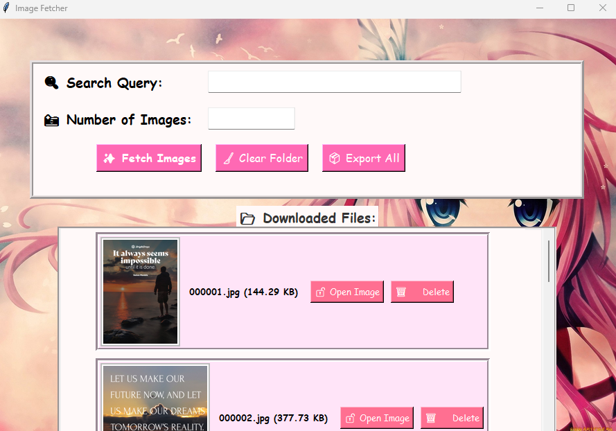
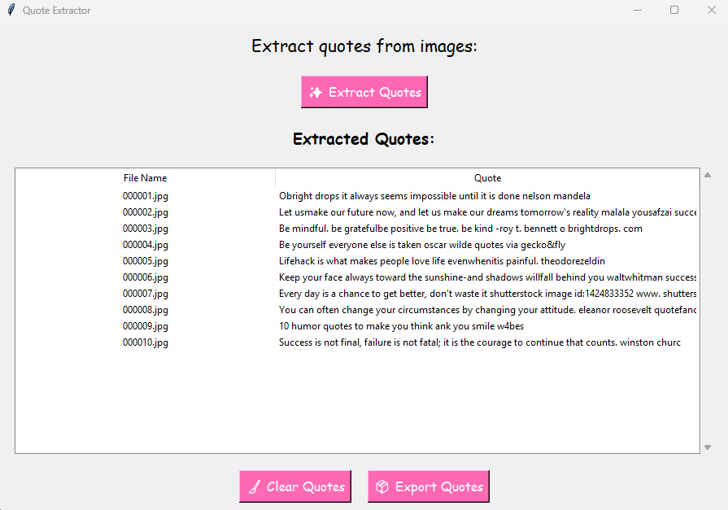

# Anime Quotes Manager

A Python-based project that allows users to:

1. **Fetch Images**: Download images from Bing using specific search queries.
2. **Extract Quotes**: Extract textual quotes from images using OCR technology.

## Features
- Fetch images directly from Bing based on keywords.
- Extract quotes from images and store them in a local SQLite database.
- Export extracted quotes to a JSON file.
- Clean and user-friendly GUI for managing tasks.

---

## System Requirements
- **Python Version**: 3.8 or higher
- **Operating System**: Windows, macOS, or Linux
- **Internet Connection**: Required for fetching images from Bing.

---

## Dependencies
The project uses the following Python libraries:

1. **icrawler** (for image fetching)
2. **Pillow** (for image processing)
3. **PaddleOCR** (for OCR text extraction)
4. **Tkinter** (for the GUI, included with Python)
5. **SQLite3** (for database management, included with Python)

### Install Dependencies
To install all required dependencies, run the following command:
```bash
pip install -r requirements.txt
```

Here’s the `requirements.txt` file:
```plaintext
icrawler==0.6.6
pillow>=9.2.0
paddleocr>=2.0.0
```

---

## Installation and Setup
Follow these steps to set up and run the project:

### 1. Clone the Repository
Download or clone the repository to your local machine:
```bash
git clone <repository-url>
cd anime_quotes_manager
```

### 2. Install Python Dependencies
Ensure you have Python installed. Then, install the required libraries:
```bash
pip install -r requirements.txt
```

### 3. Prepare Directories
Ensure the following folders exist in your project directory:
- `downloads` (to store fetched images)
- `assets` (for background images in the GUI, if used)

### 4. Run the Applications

#### **Image Fetcher**
To run the Image Fetcher:
```bash
python image_fetch_main.py
```

#### **Quote Extractor**
To run the Quote Extractor:
```bash
python quote_extract_main.py
```

---

## Usage

### 1. Fetch Images
1. Open the Image Fetcher GUI (`image_fetch_main.py`).
2. Enter a search term (e.g., "anime quotes") and the number of images to fetch.
3. Click on **"✨ Fetch Images"** to download the images to the `downloads` folder.

### 2. Extract Quotes
1. Open the Quote Extractor GUI (`quote_extract_main.py`).
2. Click **"✨ Extract Quotes"** to extract text (quotes) from the images in the `downloads` folder.
3. Review the extracted quotes in the table.
4. Export the quotes to a JSON file by clicking **"📦 Export Quotes"**.

### 3. Manage Files
- Delete unwanted images directly from the GUI.
- Clear extracted quotes from the table and database using the **"🧹 Clear Quotes"** button.

---

## Project Structure
```
anime_quotes_manager/
├── assets/                 # GUI background images (optional)
├── downloads/              # Folder for fetched images
├── image_fetch_gui.py      # GUI for Image Fetcher
├── image_fetch_main.py     # Entry point for Image Fetcher
├── image_fetcher.py        # Image fetching logic
├── quote_extract_gui.py    # GUI for Quote Extractor
├── quote_extract_main.py   # Entry point for Quote Extractor
├── quotes.db               # SQLite database for storing quotes
├── requirements.txt        # Python dependencies
└── README.md               # Project documentation
```
---

### Preview

**Image Fetcher GUI**


**Quote Extractor GUI**



---

## License
This project is licensed under the MIT License.

---

## Future Enhancements
- Add error handling for network connectivity during image fetching.
- Support for additional image formats.
- Enhance OCR accuracy by integrating alternative OCR models.

---

### Technical Highlights
- **Image Fetching:** Automated image downloading using Bing crawler.
- **Text Recognition:** PaddleOCR integration for robust text extraction.
- **Data Management:** SQLite database for storing and managing quotes.
- **Export Functionality:** Export quotes to JSON for easy sharing.

---

## Contributing
Contributions are welcome! Feel free to submit issues or pull requests for improvements.


